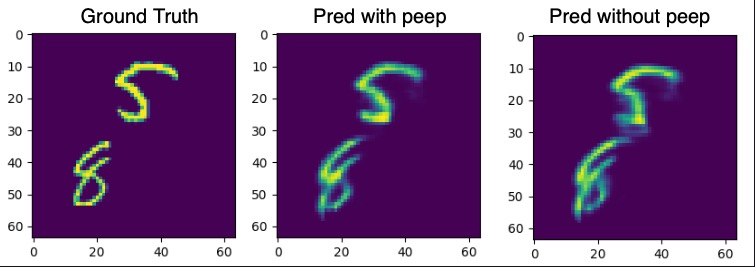
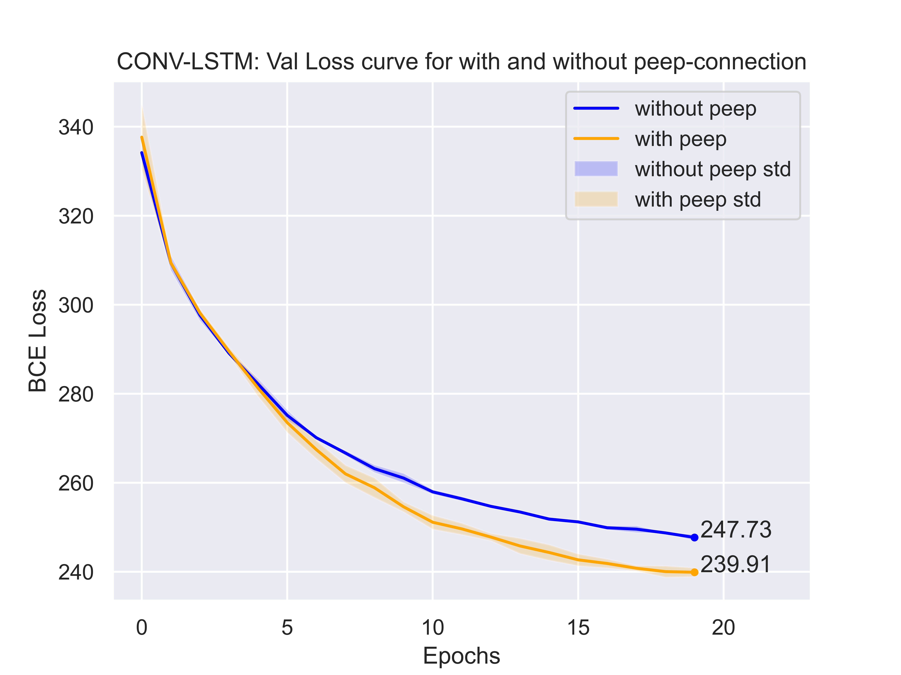

# Pytorch Lightning Template Repo

```
mkdir data
cd data
wget https://www.cs.toronto.edu/~nitish/unsupervised_video/mnist_test_seq.npy
export DATA_RAW=/Users/kaustabpal/work/moving_mnist/data/mnist_test_seq.npy
```
# Conv-LSTM
Conv-LSTM with peep and without peep connection has been implemented.

## Many to One
### With Binary Cross Entropy Loss
**Prediction**



**Loss curve**

<!--  -->


